Here is an outline for a pipeline of how to turn in beautiful assignments. It mainly relies on using [Overleaf](https://www.overleaf.com/) as the LaTeX editor. This can all be done in [Microsoft Word](https://udeploy.udel.edu/software-categories/office-productivity/), but I think LaTeX is a great skill to know and have if ever needed. If you ever need to figure out something with LaTeX, I recommend just searching "Overleaf *latex problem*". Overleaf has great documentation about how to do many things in it's platform. 

# Table of Contents 
* [Python](#python)
* [MATLAB](#matlab)

## Python

There are many ways to do steps 1-4, but I outline how to do using [Anaconda Navigator](https://www.anaconda.com/products/individual) and [Visual Studio Code](https://code.visualstudio.com/) as IDEs/code editors. All resources are free. 

1. Finalize .ipynb code.
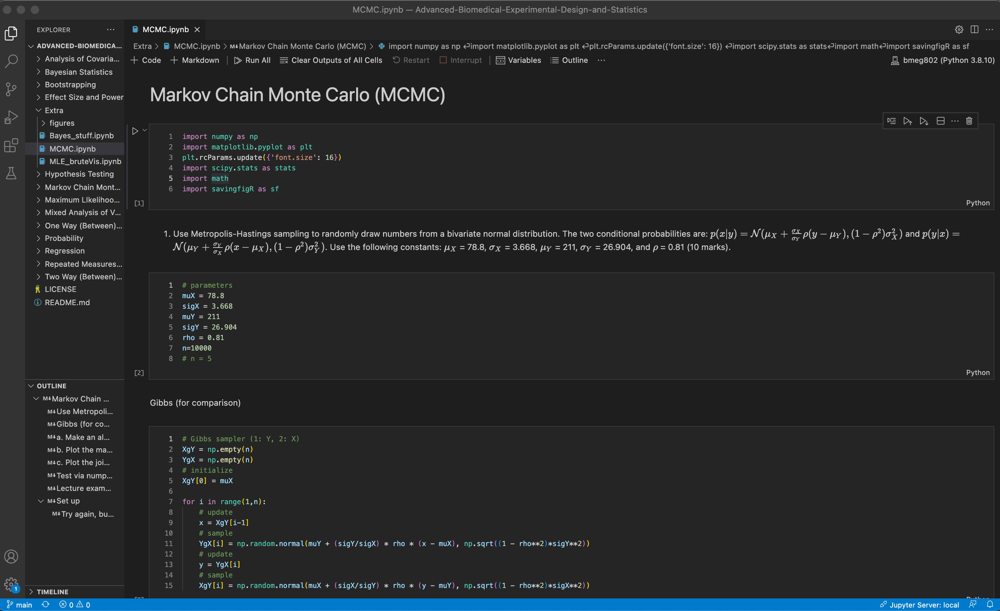
2. Open Anaconda Navigator.
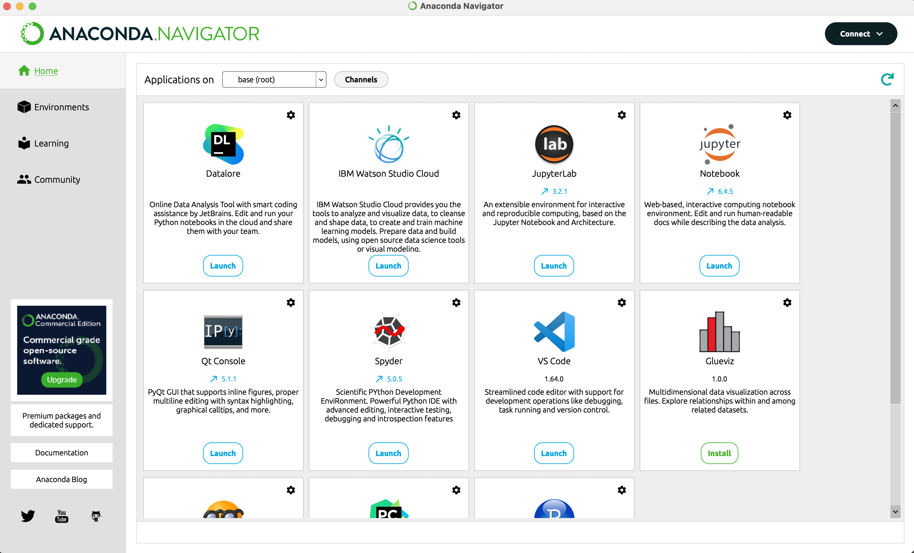
3. Launch Jupyter Notebooks and navigate to assignment .ipynb.
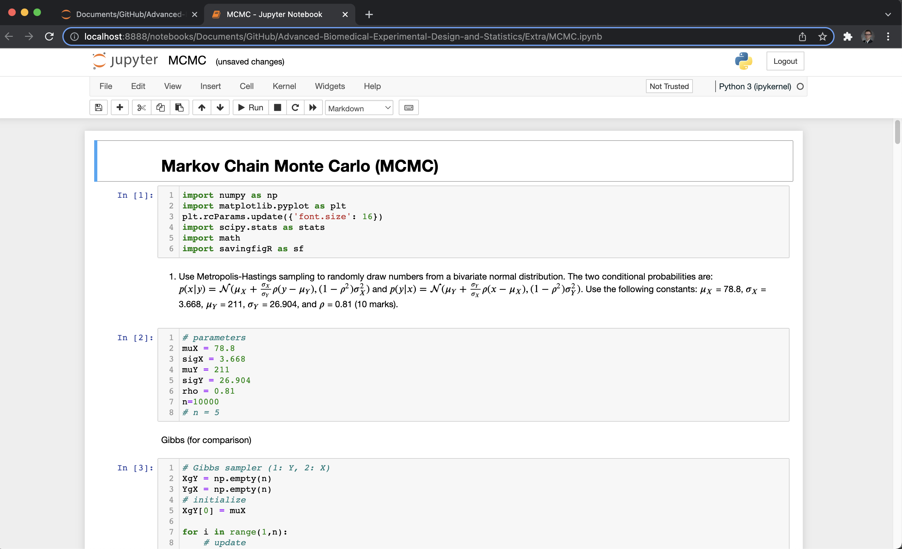
4. Print (Command + P or Ctrl + P) > Save as PDF.
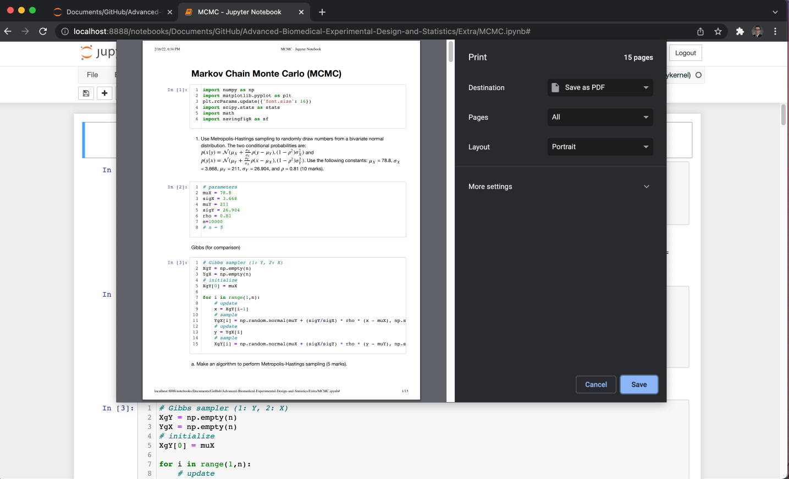
5. Open Overleaf and create a new project (e.g. document) (feel free to use this LaTeX [outline](https://github.com/tulimid1/Advanced-Biomedical-Experimental-Design-and-Statistics/blob/main/A0X_outline.tex)).
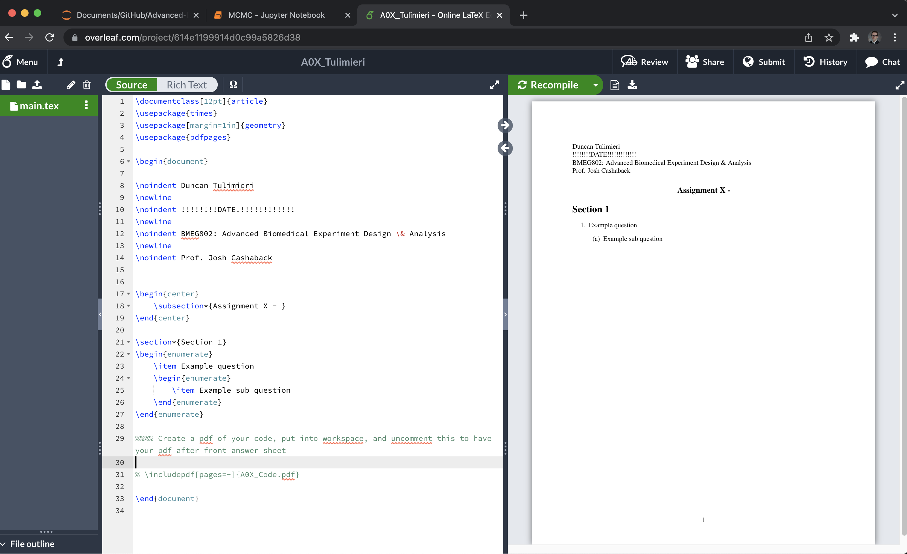
6. Add answers to answers and figures via LaTeX code. 
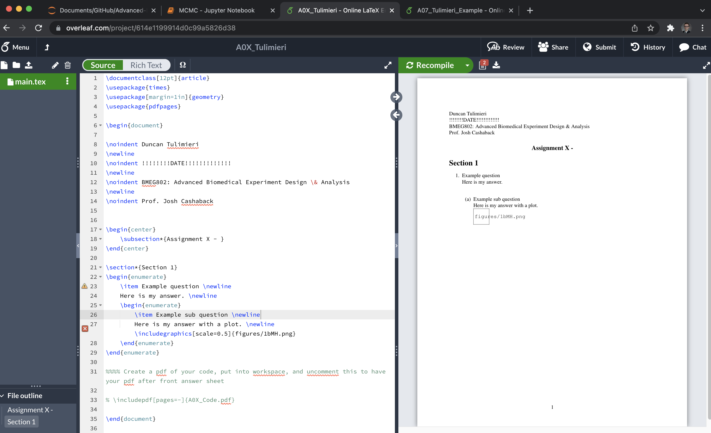
7. Upload figures and code PDF.
* I recommend creating a new folder so the project workspace doesn't get crazy. 
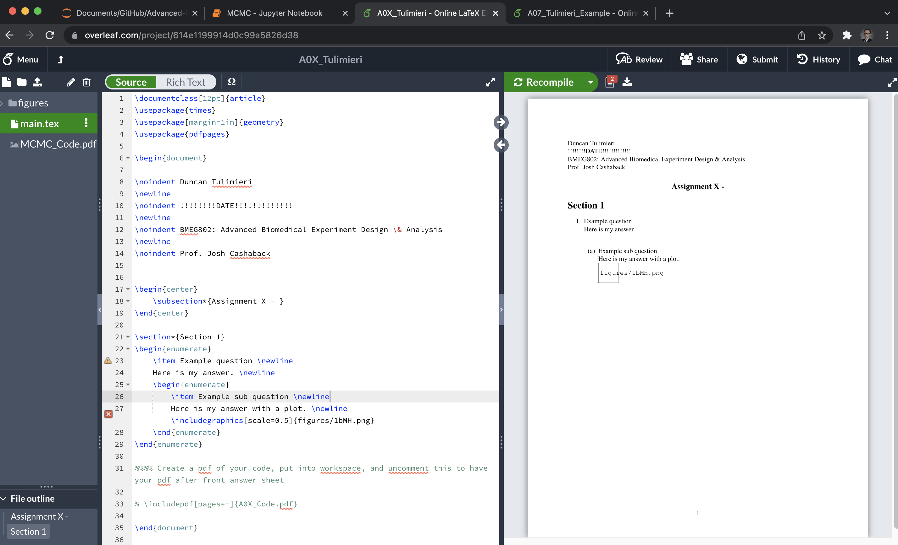
8. Compile. 
* This is when you will see the figures start to show up in the document preview. 
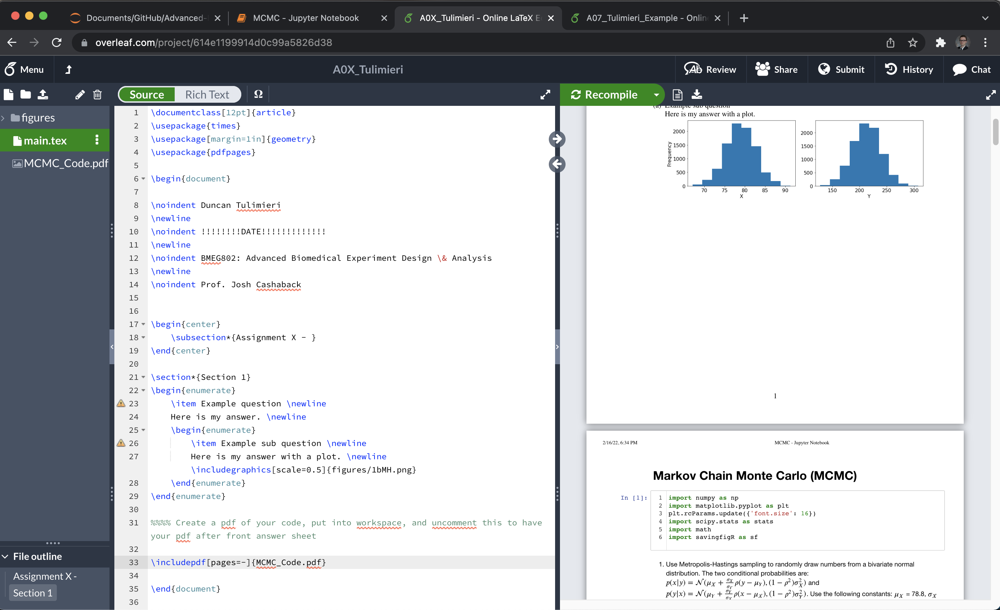

## MATLAB 

This is all a bit simplier in MATLAB. 

1. Finalize .mlx code.
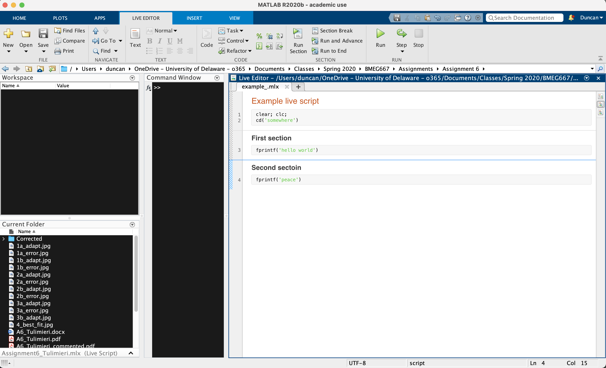
2. Save > Export to PDF.
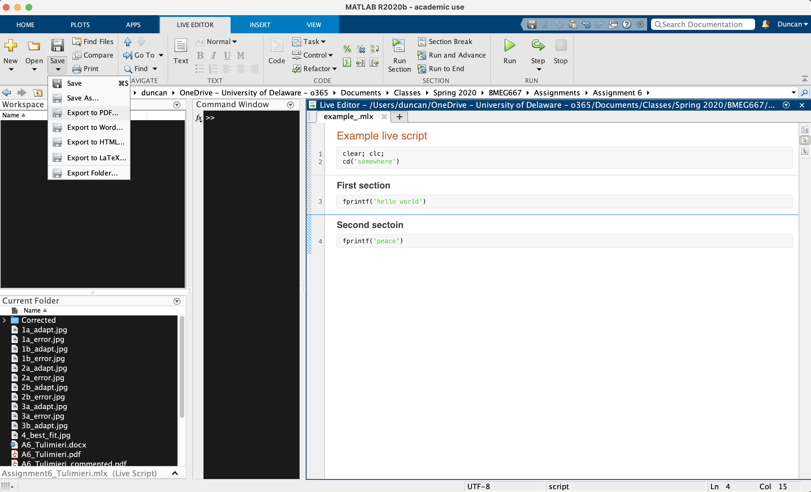
3. Open Overleaf and create a new project (e.g. document) (feel free to use this LaTeX [outline](https://github.com/tulimid1/Advanced-Biomedical-Experimental-Design-and-Statistics/blob/main/A0X_outline.tex)).

4. Add answers and figures via LaTeX code. 

5. Upload figures and code PDF.
* I recommend creating a new folder so the project workspace doesn't get crazy. 

6. Compile. 
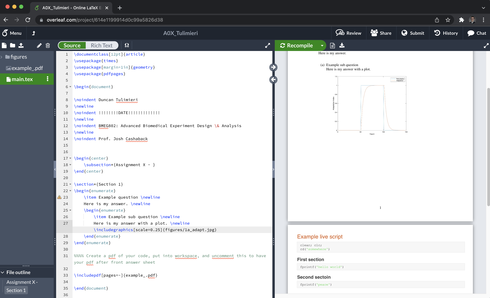
