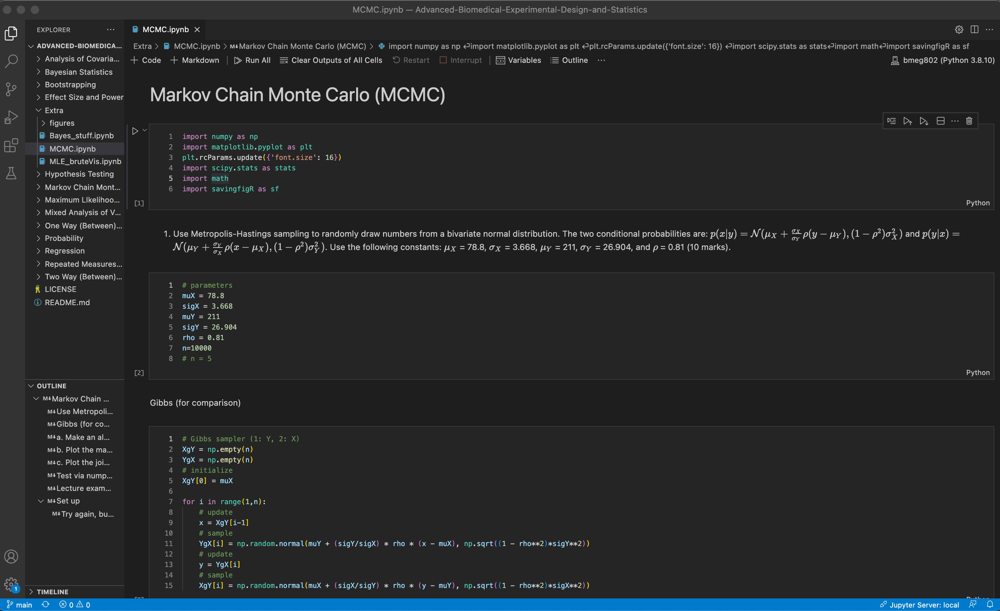
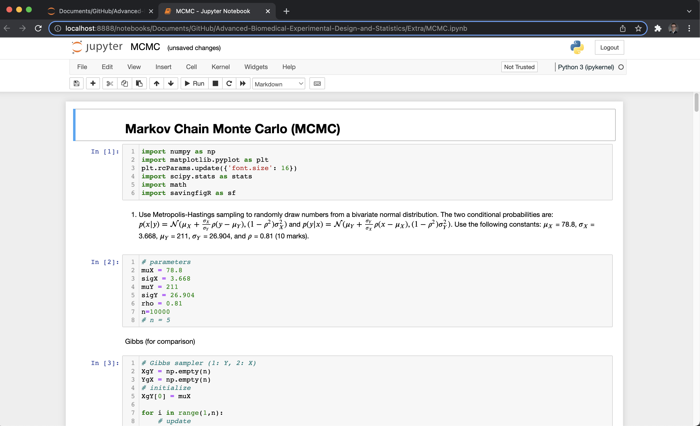
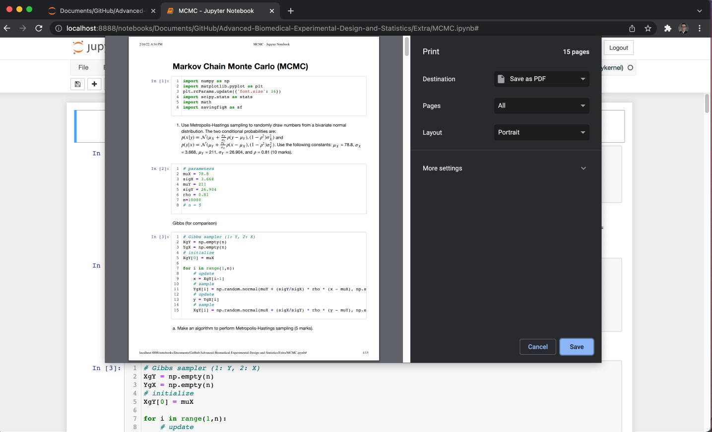

Here is an outline for a pipeline of how to turn in beautiful looking assignments. It mainly relies on using [Overleaf](https://www.overleaf.com/) as the LaTeX editor. This can all be done in [Microsoft Word](https://udeploy.udel.edu/software-categories/office-productivity/), but I think LaTeX is a great skill to know and have if ever needed. 

# Table of Contents 
* [Python](#python)
* [MATLAB](#matlab)

## Python

There are many ways to do steps X-Y, but I outline how to do using [Anaconda Navigator](https://www.anaconda.com/products/individual) and [Visual Studio Code](https://code.visualstudio.com/) as IDEs/code editors. All resources are free. 

1. Finalize .ipynb code.

2. Open Anaconda Navigator.

5. Launch Jupyter Notebooks and navigate to assignment .ipynb.

7. Print (Command + P or Ctrl + P) > Save as PDF.

9. Open Overleaf and create a new project (e.g. document) (feel free to use outline given).

12. Add answers to answers and figures via LaTeX code. 

14. Upload figures and code PDF.
* I recommend creating a new folder so the project workspace doesn't get crazy. 

15. Compile. 
* This is when you will see the figures start to show up in the document preview. 

## MATLAB 

This is all a bit simplier in MATLAB. 

1. Finalize .mlx code.
2. Save > Export to PDF.
3. Open Overleaf.
4. Create a new document (feel free to use outline given).
5. Add answers to answers page with figures (recommend looking at [best_save function](https://tulimid1.github.io/savingfigR/best_save_m/)).
6. Upload figures and code PDF.
7. Compile. 
